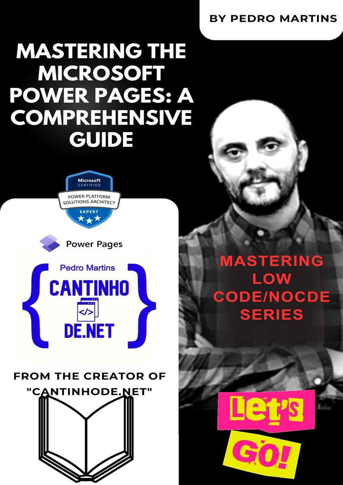

# Mastering the Microsoft Power Pages: A Comprehensive Guide

## Introduction

In today's rapidly evolving technological landscape, the demand for efficient and agile solutions has never been greater. The emergence of low-code and no-code platforms has revolutionized the way we build applications and solve complex problems. Among these platforms, the Microsoft Power Platform stands out as a versatile and robust toolset, enabling users to create innovative solutions with ease.

If you want to become a master of Microsoft Power Pages, this comprehensive guide is all you need. It contains all the information you require to enhance your skills and become an expert in no time. Irrespective of whether you're a beginner or just looking to refresh your knowledge, this guide has got you covered. Don't wait any longer. Start learning today and take your Microsoft Power Pages skills to the next level! is a testament to the growing importance of this platform in the world of business and technology. This book is a result of the collective expertise and dedication of its authors, who have poured their knowledge and experience into crafting a comprehensive resource for both beginners and seasoned professionals.

The **Power Platform allows** users with diverse skill sets to collaborate seamlessly, bridging the gap between business and IT. With its powerful capabilities for data analysis, automation, app development, and more, the platform empowers individuals to transform their ideas into reality without the need for extensive coding expertise.

As a reader, you are about to embark on a journey that will empower you to become a master of the Microsoft Power Platform. Whether you are an entrepreneur looking to streamline your business processes, an analyst aiming to gain valuable insights from data, or an IT professional seeking to accelerate application development, this guide has something valuable to offer.

Throughout the book, you will find practical examples, step-by-step tutorials, and best practices that will help you unlock the platform's full potential. Additionally, the authors' insights into real-world use cases will inspire you to explore creative solutions to complex challenges.

We would like to extend our gratitude to the authors for their dedication and passion in creating this valuable resource. Their commitment to helping others succeed with the Power Platform is evident in every chapter.

As you dive into **"Mastering the Microsoft Power Pages: A Comprehensive Guide"** we encourage you to embrace the possibilities that the Power Platform offers. Embrace the low-code and no-code revolution, and let your imagination guide you in creating innovative solutions that can drive your organization forward.

May this book serve as a guiding light on your journey to mastering the Microsoft Power Platform.

**Dr. Pedro Martins, Solution Architect**

